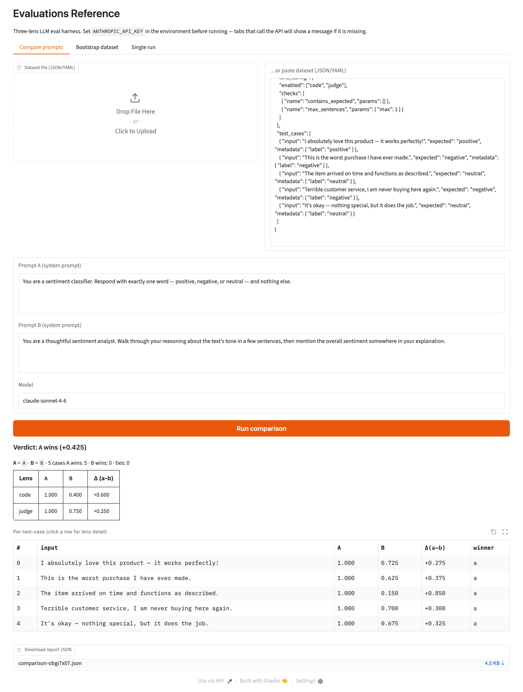

# Evaluations Reference

A production-mindful, three-lens evaluation harness for LLM systems. It grades
model outputs through **deterministic code checks**, a **model-as-judge**, and
**human review** — and wraps them in a side-by-side prompt comparison that
answers the only question that matters when you change a prompt: *did this
actually make things better?*



*The comparison tab after a live run: per-lens score deltas, per-test-case
winners, and an overall verdict. Two more tabs cover dataset bootstrapping and
single-prompt eval runs.*

## Quickstart (under five minutes)

```sh
uv sync                          # install
export ANTHROPIC_API_KEY=sk-...  # or put it in a local .env

# Compare two sentiment-classification prompts on a shipped example dataset:
uv run evals compare examples/sentiment/dataset.json \
  --prompt-a examples/sentiment/v1.txt \
  --prompt-b examples/sentiment/v2.txt
```

You'll get a terminal table of per-lens deltas, a per-test-case win/loss
breakdown, an overall verdict, and a JSON report on disk. Prefer a browser?
`uv run evals ui` opens the same flow as a local web app.

## What's in this repo

**Three lenses** — each test case is graded by every enabled lens, and scores
aggregate per lens:

| Lens | What it does |
|---|---|
| **Code** | Deterministic checks (length bounds, keyword presence/absence, regex, JSON/Python/regex validity, sentence count, expected-value match). Fast, free, exact. |
| **Model-as-judge** | An LLM scores relevance and faithfulness against a per-dataset rubric. Default `claude-sonnet-4-6`; swappable behind a protocol. |
| **Human** | Interactive 1–5 rating in the CLI. Auto-skips off-TTY or when `SKIP_HUMAN_EVAL=1`. |

**Five CLI commands** (`uv run evals <command>`):

| Command | Description |
|---|---|
| `run <dataset>` | Grade a dataset through its enabled lenses; write a JSON report. |
| `compare <dataset> --prompt-a A --prompt-b B` | Run two prompt variants side by side and diff the results. |
| `bootstrap --description … --count N --output …` | Generate a dataset of test cases from a plain-language description. |
| `describe <dataset>` | Summarize a dataset (case count, lenses, rubric) without running it. |
| `ui` | Launch the three-tab Gradio browser app. |

**Tech stack** — Python ≥3.11, the [Anthropic SDK](https://github.com/anthropics/anthropic-sdk-python),
[Gradio](https://www.gradio.app/) for the UI, [uv](https://docs.astral.sh/uv/)
for packaging, and `ruff` / `pyright` / `pytest` for quality.

## How it works

A dataset is a list of test cases (`input`, optional `expected`, `metadata`)
plus a lens configuration and an optional judge rubric, in JSON or YAML. The
runner produces an output for each case — from a prompt variant via the
candidate model, or from the reference answer — then grades it through the
enabled lenses and aggregates the scores.

Full walkthrough — dataset format, every command, the lenses, and the UI — is in
**[TUTORIAL.md](TUTORIAL.md)**.

## Example datasets

Three ready-to-run examples under [`examples/`](examples/), each with a rubric
and two prompt variants so you can run `evals compare` immediately:

- **`sentiment/`** — classify text as positive / negative / neutral (code: label match; judge: rationale).
- **`json_extraction/`** — pull fields from invoice-style text as JSON (code: JSON validity + required fields; judge: value accuracy).
- **`summarization/`** — summarize a short article (code: length / sentence bounds; judge: faithfulness + comprehensiveness).

## Related

- **[charlescozad.com/demos/rag/](https://charlescozad.com/demos/rag/)** applies this three-lens pattern to a complete RAG system.
- **Commercial / mature alternatives** — if you need this in production today, look at [Promptfoo](https://www.promptfoo.dev/), [LangSmith Evaluations](https://docs.smith.langchain.com/), [Braintrust](https://www.braintrust.dev/), and [Inspect AI](https://inspect.aisi.org.uk/). They offer hosted dashboards, dataset versioning, statistical tooling, and integrations this reference deliberately leaves out. This repo is a clear, hackable reference implementation of the *pattern*, not a competitor to those products.

## What I would change for production

This is a reference implementation. The lenses and the comparison flow are the
durable ideas; the surrounding infrastructure is intentionally minimal. The next
migrations, in rough priority order:

- **Result persistence.** Everything is JSON-on-disk today, which is great for a demo and useless for a team. The first move is a database-backed run history (Postgres or similar) keyed by dataset, prompt, and model version. It's not in v1 because a schema is a commitment, and the right schema depends on how you slice results — which the next two items decide.
- **Longitudinal tracking.** The single most valuable thing persistence unlocks is charting score drift across model versions and prompt iterations. A one-shot verdict tells you A beat B today; a trend line tells you whether your eval set is still measuring what you think. Left out because it's meaningless without persisted history first.
- **Multi-judge runs.** The judge is already swappable behind a protocol, but a single judge is a single point of bias. Production should run the same eval through several judges and report agreement, not just a number. The abstraction is here; automating the fan-out and reconciliation is the missing piece.
- **Statistical significance.** With five test cases, a "win" is mostly noise. Real use needs confidence intervals and a minimum-detectable-effect calculation so a 0.02 delta isn't reported as a victory. Omitted because honest significance math also requires larger, persisted datasets to be worth showing.
- **Cost tracking.** Token spend per run is invisible right now. A judge-heavy comparison over a large dataset can get expensive fast, and any team running this on a budget needs per-run cost surfaced next to the scores. Straightforward to add; left out to keep the core loop legible.
- **Experiment-tracking integration.** Teams that already live in Weights & Biases or MLflow will want eval runs to land there alongside training metrics, rather than in a bespoke store. The clean version is an adapter layer; v1 just writes JSON.
- **Streaming UI for large eval sets.** The batch UI is fine for tens of cases and gets unwieldy for thousands. A production UI would stream and paginate per-case results and let you filter to the disagreements. The progress hook is already in the runner; the UI just doesn't lean on it for large sets yet.

## License

[MIT](LICENSE)
